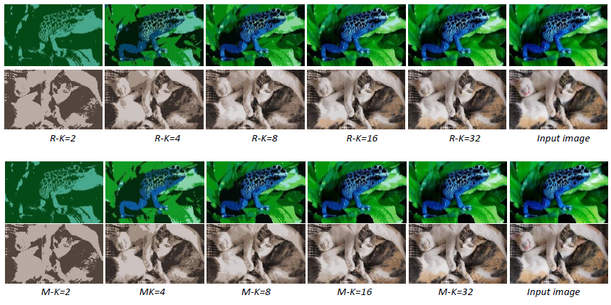
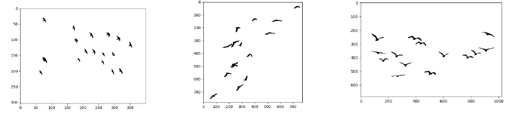

## Part 1: Color Quantization 

```color_quantization.py```: Color quantization implementation on Python using k-mean algorithm. 
The primary function is ```quantize(img, K)``` which takes an image and number of colors (K) as input and generates a quantized version of the image as output. 
Firstly, the image is converted to a matrix of pixels (pixel_matrix) with the size of (height*width,3). Then, K initial x and y coordinates are chosen manually or randomly. The RGB colors of these coordinates are obtained. After that, the matrix of pixels and RGB of selected K colors are given to the ```k_means(pixel_matrix, color_centers)``` function. An array for output image size (height*width,3) is initialized (output_array). At each iteration, for each color x in the pixel_matrix, the function calculates the color distance (using ```distance_calculation(color_one, color_two)```) between color x and each of the K color centers, and then, the color x is added to the cluster of the nearest color center. The pixel of color x is updated with the color of its cluster in output_array. After repeating this for each image pixel, each color will be in the cluster of the color center nearest to it. Then, taking the mean RGB value of each cluster, the K color centers are updated. Then, the iteration restarts. This continues until we reach the iteration limit, which is 10 in our case. After 10 iterations, the output_array is saved as an image containing only K colors. We need to keep in mind that even though increasing the number of K increases the visual quality of images, there is a trade-off between execution time and the number of colors. Therefore, K should be selected carefully.

Example of output images using 2, 4, 8, 16 and 32 K for randomly (R-K) and manually (M-K) selected colors:
<p align="center"></p>


## Part 2: Connected Component Analysis

```connected components analysis.py```: Implementation of a connected component analysis algorithm from scratch

Appropriate preprocessing steps (containing different combinations of morphological operations and/or threshold techniques and/or threshold values) which optimizes the selected input image and return a binary image are selected first. Then, by using the preprocessed image, a connected component analysis is performed. We start from (x=0, y=0) pixels and read the color information (black or white) of pixels. When we find a black pixel, we label it as a new component, and then by looking at its 8 neighbors, we find all pixels belonging to this component, and we label them until there is no black unlabeled pixel in the neighbors. We continue to read pixel values until we reach once again an unlabeled black pixel, and so on. A recursive function named ```connectedNeighboursSearch(new_image, componentCounter)``` is created for mentioned operations. 

The outputs of birds images:
<p align="center"></p>


##### This project was implemented for CmpE 537 Computer Vision Course of Bogazici University.
